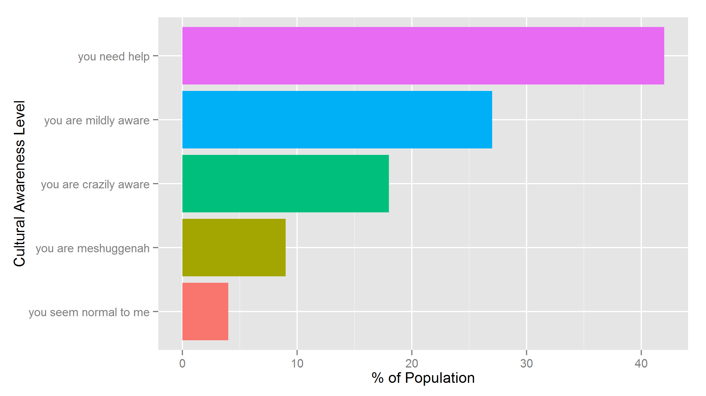

DevDP-ClassProject
========================================================
author: Mark Friedman
date: 2015 08 23

Introduction
========================================================

Predicting Cultural Normalcy is a hot topic on the Internet. For example, Facebook wants you to take personality quizzes, your employers wants you to do a Myers-Briggs assessment, your spouse wants you take out the garbage without complaining.  All of these are indicators.  For this project, we have focused on several important cultural concepts.

- Space Exploration
- British Humor
- American Cult Films, and
- Old Time Radio

The Components
========================================================
* We love Star trek!
* Dr. Who provides deep insight into the timely and timeless.
* Love it or hate it, Rocky Horror is a rite of passage.
* The Red Panda, Black Jack Justice.  Goodness prevails.

*Knowing about an item sets one of the indicator flags below*


```r
factors <- c("star","button","rhps","podcast")
```

The Scores
========================================================
We create a scale score from 0 to 4 representing level of cultural awareness.  The scale descriptions are as follow:


```
  values                scores
1      0         you need help
2      1  you are mildly aware
3      2 you are crazily aware
4      3   you are meshuggenah
5      4 you seem normal to me
```

National Average
========================================================
These results are completely random.  Which group did you fit into?



Thanks and Credits
========================================================
- R Graphics Cookbook by Winston Chang
- Star Trek by Gene Roddenbery
- Dr. Who by the British People
- Rocky Horror Picture Show by Jim Sharman and Richard O'Brien.
- [Decoder Ring Theatre](http://decoderringtheatre.com/)

